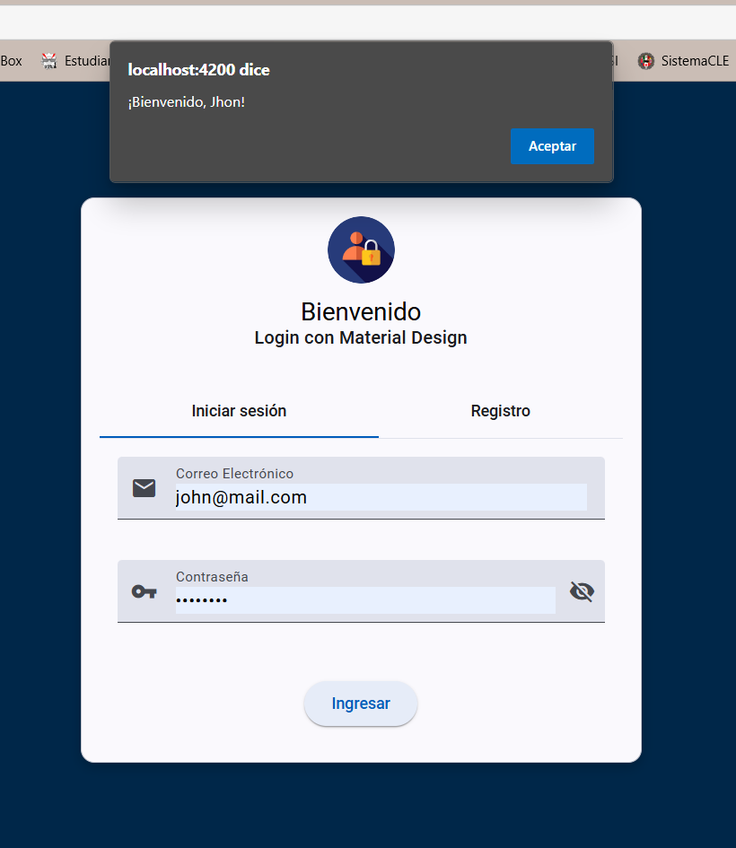

# ProgramWebLoginAQOP

Parte 1: CREACION DEL PROYECTO
Entramos al explorador de archivos, y seleccionamos una carpeta en donde se desea crear el proyecto, en mi caso, estará en una partición de disco, y agregue la carpeta con el nombre de "ProgramWeb-Login_AQOP". 

https://drive.google.com/file/d/1A0xbXI-PbOQFQkH1KYffRab0OL92fTIy/view?usp=sharing

Despues ingresamos al powershell, y escribimos el siguiente comando que es "cd A:\ProgramWeb-Login_AQOP", para que este dentro de la carpeta, luego, se ingresa el siguiente comando "ng new ProgramWeb-Login_AQOP",, ya que se creara el proyecto Angular con el nombre igual que la carpeta de un inicio. 

https://drive.google.com/file/d/1A0xbXI-PbOQFQkH1KYffRab0OL92fTIy/view?usp=sharing

Se mostrara algunas puntos que se deberá instalar, como es el tipo de formato, en este caso selecciono el CSS, se seleccionará e igual nos pedirá si se desea poner un Server-Side Rendering, tambien se da en aceptar.

https://drive.google.com/file/d/1Fw0f1QWCiJKLiDj_iGAPzQ1gaXH12eMZ/view?usp=sharing

https://drive.google.com/file/d/1qwQ_NcnTnWT_33QGTJLbbvf2jrySovck/view?usp=sharing

De inmediato se creara todos los componentes necesarios, aproximadamente lleva un tiempo de 5 minutos para su instalación. Una vez terminado, lo abriremos con Visual Studio Code, para poder realizar la pagina.

https://drive.google.com/file/d/1hJO8deovwymwx65rxEXx-lFOu1xr_7Am/view?usp=sharing

https://drive.google.com/file/d/1ucz-Ik3yqHcMLS14__c7wWo1jq1rsNSx/view?usp=sharing

*******************************************************************************************
Parte 2:
En la parte de Visual Studio Code, se estará trabajando desde la carpeta de APP y en la terminal se crearan tres carpetas, una que se llamara "Login", "Home" y "Principal", mediante este comando:
* ng generate component (nombre de la carpeta), este crea la carpeta con sus componentes 
* ng generate module (nombre del archivo) --module app, crea un archivo de .ts

Una vez ejecutado las carpetas, se tendrá que ver algo asi:

https://drive.google.com/file/d/1n1p-ujqS4hoixmu-5Q7CBKHy7Y45TBWn/view?usp=sharing

*******************************************************************************************
Parte 3: TRABAJO EN LA CARPETA "LOGIN"
En el archivo "login.component.html", por lo que este código define una interfaz de usuario para un sistema de autenticación que utiliza Angular Material para los estilos y componentes. Consiste en un contenedor principal que incluye un diseño con pestañas (<mat-tab-group>), donde se presentan dos funcionalidades principales: Iniciar sesión y Registro.

https://drive.google.com/file/d/1n1p-ujqS4hoixmu-5Q7CBKHy7Y45TBWn/view?usp=sharing

En el archivo "login.component.css", define los estilos para un diseño centrado y moderno, ya que centra el contenido principal en la pantalla, Alinean el encabezado y agregan la imagen como avantar, entre otras características.

https://drive.google.com/file/d/1f6LC9XUptePSnXeVjF9BZ4IGjybsU_L5/view?usp=sharing

El archivo "login.component.ts", se  implementa la lógica de un componente de inicio de sesión y registro en Angular. Utiliza Angular Material para los estilos de la interfaz y un servicio (UserService) para manejar la validación de usuarios con una API externa. Incluye:
Función de inicio de sesión:

* Valida que los datos ingresados sean correctos.
* Redirige al usuario a una página principal en caso de éxito.
* Maneja errores del servidor de manera amigable.

Vista preliminar de registro:

* El método registrar() está por implementar, pero servirá para manejar nuevos usuarios en el futuro.
 

https://drive.google.com/file/d/1knBCo77BdPwVqeG2vnl-IKPepSF8pTvJ/view?usp=sharing

https://drive.google.com/file/d/1HgagtWsLODjmzXCctV9p9GvLY7jWXZIe/view?usp=sharing

*******************************************************************************************
Parte 4: TRABAJO EN LA CARPETA "HOME"
Esta carpeta tiene todo el contenido de la segunda pagina, cuando los datos del usuario que se encuentran en la API, fueron validos 

En el archivo "home.component.html", por lo que este codigo implementa una barra de herramientas (toolbar) en Angular utilizando Angular Material. Por lo que incluye Opciones de navegación principales (Inicio, Acerca de, Contacto), Un menú desplegable para configuraciones de usuario y Enrutamiento dinámico para cargar contenido según la ruta seleccionada.

https://drive.google.com/file/d/1NhNUNikfKJV3tIkr3Nrd9IYNxebVKvTa/view?usp=sharing

En la parte de css, el codigo Aplica estilos personalizados a Barra de herramientas, Menú desplegable, Contenido principal y Mejora la experiencia visual con colores consistentes, transiciones suaves y efectos modernos.

https://drive.google.com/file/d/11u5yb3Q86OM6Km4vcXqaWN4HDBQDNKhZ/view?usp=sharing

En el archivo "home.component.ts", este codigo implementa un componente en Angular llamado HomeComponent, que utiliza Angular Material para diseñar una interfaz, por lo que realiza las importaciones de modulos que proporcionan funcionalidades especificas, El decorador, ya que este define las propiedades y configuraciones del componente y proporciona una navegación entre rutas con RouterModule. 

https://drive.google.com/file/d/1kmBsZ3dRcitHWGKuVtuGSQsDKGVbx7QB/view?usp=sharing

*******************************************************************************************
Parte 5: CREACION DE LA CARPETA "SERVICE"

En la terminal del mismo Visual Studio Code, se ejecutara el siguiente comando "ng generate service services/user", en donde se creara una carpeta "service", que tendrá todos sus componentes para realizar la consulta con la API, algo asi debe de contener 

https://drive.google.com/file/d/1Ma1lf5TbQRG7ZVFiWzs1__oimPtRtojj/view?usp=sharing

Se realizará cambios en el archivo "user.service.ts" ya que el servicio UserService se encarga de manejar las interacciones con la API de usuarios, facilitando:

La obtención de datos de usuarios mediante getUsers().
La implementación futura de otras operaciones relacionadas con usuarios, como la creación de nuevos registros (createUser()). Lo que centraliza la lógica para interactuar con la API, haciendo que los componentes puedan reutilizar este servicio de manera eficiente.

https://drive.google.com/file/d/10APSQk14XivNX979NG81VrsatHi4G65J/view?usp=sharing

*******************************************************************************************
Parte 6: CONFIGURACION DE LOS ARCHIVOS APP
En el archivo "app.component.html", tiene un fragmento de codigo, ya que su propósito es estructurar el contenido principal de la aplicación y permitir la carga dinámica de componentes en base a la ruta establecida, por lo que es una pieza clave para construir aplicaciones SPA (Single Page Applications), donde toda la navegación ocurre dentro de una sola página HTML, en si es una pieza clave para construir aplicaciones SPA (Single Page Applications), donde toda la navegación ocurre dentro de una sola página HTML.

https://drive.google.com/file/d/18YeY1toE5VddzdMZr_EjVWQQLKjbxJof/view?usp=sharing

En el archivo "app.component.ts", se proporciona un codigo que representa el componente raíz de la Aplicación Angular, este sirve como punto de entrada para renderizar la aplicación y establecer su estructura principal, además importa módulos esenciales (Angular Material, formularios, enrutamiento) para proporcionar funcionalidad y estilo al resto de la aplicación. 

https://drive.google.com/file/d/1CrK0T7J8VND5ZbT2GfZGK_6APPpbLsV3/view?usp=sharing

En el archivo app.module.ts, este es un modulo que es parte de la arquitectura modular de  Angular, donde diferentes partes de la aplicación (como login y home) están separadas en sus propios módulos y sirve como base para integrar estas funcionalidades y organizar el flujo de la aplicación.

https://drive.google.com/file/d/1CrK0T7J8VND5ZbT2GfZGK_6APPpbLsV3/view?usp=sharing

El código en el archivo app.routes.ts define las rutas (paths o direcciones URL) para la navegación dentro de la aplicación Angular. Cada ruta está asociada con un componente que se renderiza cuando el usuario navega a esa URL específica. Las rutas definidas son: 

* Ruta principal (/): Redirige a la página de login (/login).
* Ruta /login: Muestra el LoginComponent.
* Ruta /home: Muestra el HomeComponent (actualmente sin subrutas).
* Ruta /usuarios: Muestra la UsuariosListaComponent.
Este sistema de rutas organiza cómo se navega dentro de la aplicación y cuál componente se debe mostrar para cada URL específica.

https://drive.google.com/file/d/1S_IQHrsW9I6MgWkERFh3C6yhTPJXJWlI/view?usp=sharing

*******************************************************************************************

Parte 7: EJECUCION Y RESULTADOS 

Para ejecutar el proyecto, se utiliza el siguiente "ng serve", por lo que se deberá abrir la siguiente liga " http://localhost:4200" desde un navegador para ver el resultado.

Como primera pagina deberá de aparecer el login, que en base a los datos registrados en la API, deberán ser validados para que se pueda ingresar, por ejemplo, el de Jonh asi como aparece en la API

https://drive.google.com/file/d/1stpQQqNn8NwJOlwtvZkP6kAtM9WwMOwS/view?usp=sharing

https://drive.google.com/file/d/1OrGxsiqDXCW03K4VclCMozEBBD3mo8EI/view?usp=sharing

De inmediato abrirá la siguiente pagina, que contiene un menú de forma horizontal, solo para verificar que si se validaron los datos 

https://drive.google.com/file/d/1IxgfSpDjsnDA2TCXqNd4WPZL_ybirjCY/view?usp=sharing

